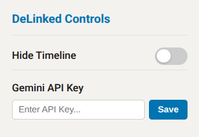

# DeLinked

A Chrome extension that cuts through LinkedIn noise.

## Motivation

LinkedIn is just AI slop and corporate cringe. Everyone uses ChatGPT to make long, fake stories to make themselves look important.

DeLinked exists to mock them. It lets you block the feed completely, or click the "Debullshitify" button to translate the fake text into what they actually mean.

## Setup

1. Clone the repo.
2. Go to `chrome://extensions`, enable Developer Mode, and click "Load unpacked".
3. Select the project folder.
4. Open the extension popup and paste in your [Gemini API key](https://aistudio.google.com/app/api-keys).

## Screenshot

